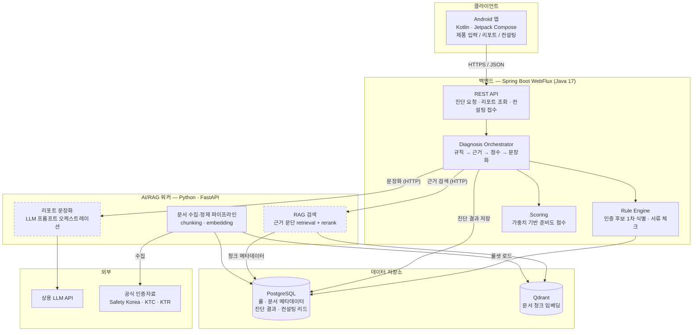
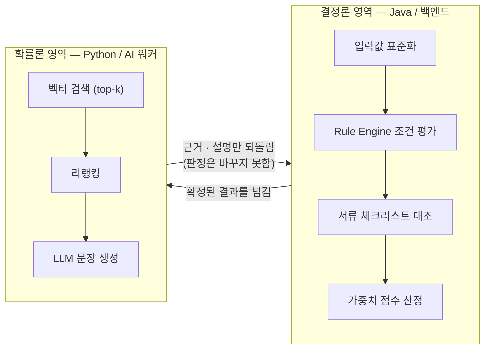
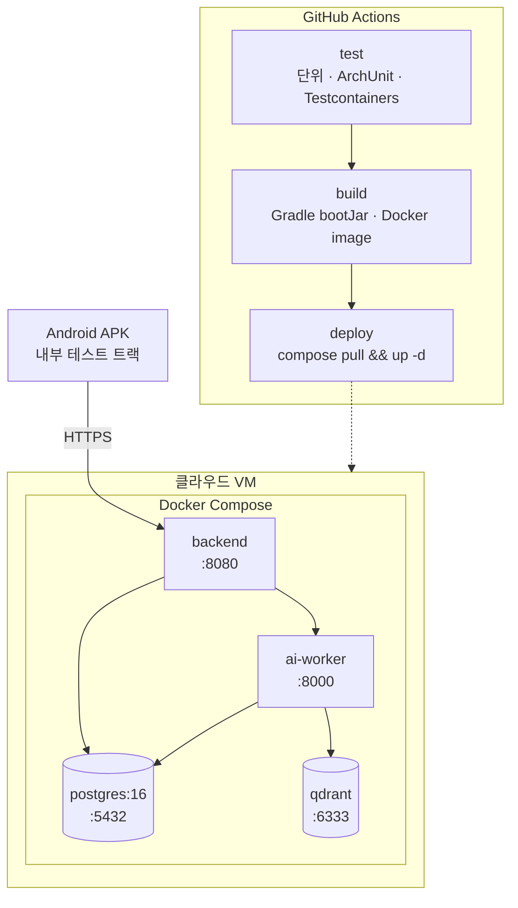

# 01. 시스템 아키텍처

## 1.1 전체 구성

점선 테두리(`RAG`, `NARR`)는 **실패해도 진단이 완료되는** 컴포넌트입니다. 기획서의 "API 호출 실패, RAG 검색 실패, 외부 LLM 응답 지연 상황에 대비해 기본 규칙 기반 결과와 오류 안내 메시지를 우선 제공한다"를 아키텍처 제약으로 못 박은 것입니다. 자세한 폴백 규칙은 [03-diagnosis-flow.md](03-diagnosis-flow.md#34-장애-폴백-정책)에 있습니다.

## 1.2 컴포넌트 책임 경계

Spring Boot 백엔드와 Python 워커를 나누는 기준은 "언어 취향"이 아니라 **결정론이 필요한가**입니다.

**단방향 제약**: AI 워커의 응답은 진단 결과의 *판정*을 변경할 수 없습니다. 근거(`Evidence`)를 붙이거나 설명(`Narration`)을 채울 뿐입니다. 이 제약이 "LLM이 근거 없이 인증명이나 판단을 생성하는 위험"을 구조적으로 차단합니다.

## 1.3 요청 경로별 성격

| 경로 | 특성 | 처리 방식 |
| --- | --- | --- |
| Android → 백엔드 | 짧은 JSON, 다수 동시 요청 | WebFlux 논블로킹 |
| 백엔드 → PostgreSQL | 블로킹 JDBC (JPA) | 전용 `Scheduler`로 격리 ([ADR-0002](adr/0002-webflux-with-jpa.md)) |
| 백엔드 → AI 워커 | 수백 ms ~ 수 초 지연 | `WebClient` 논블로킹 + 타임아웃 + 폴백 |
| AI 워커 → LLM | 수 초 지연, 실패 가능 | 워커 내부에서 타임아웃, 백엔드는 폴백 보유 |

WebFlux를 택한 실익은 세 번째 줄에 있습니다. 진단 한 건이 RAG와 LLM을 기다리는 동안 스레드를 점유하지 않습니다.

## 1.4 배포 토폴로지

해커톤 규모에서 Kubernetes는 비용 대비 효익이 없습니다. 단일 VM + Compose로 시작하고, 컨테이너 경계만 정확히 나눠 두면 이후 이관은 어렵지 않습니다.

## 1.5 관련 결정 기록

- [ADR-0001: 헥사고날 아키텍처 채택](adr/0001-hexagonal-architecture.md)
- [ADR-0002: WebFlux + JPA 조합과 블로킹 격리](adr/0002-webflux-with-jpa.md)
- [ADR-0003: Rule Engine과 LLM의 책임 분리](adr/0003-rule-engine-over-llm.md)
- [ADR-0004: AI 워커를 별도 프로세스로 분리](adr/0004-separate-ai-worker.md)
