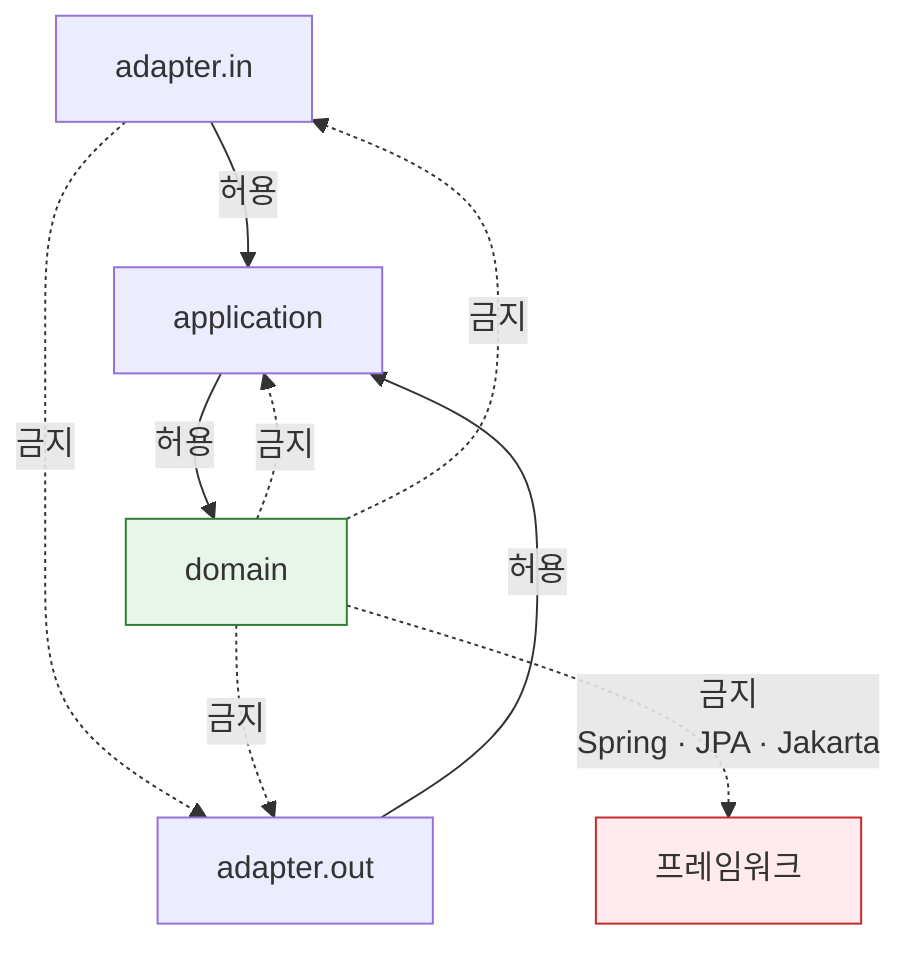
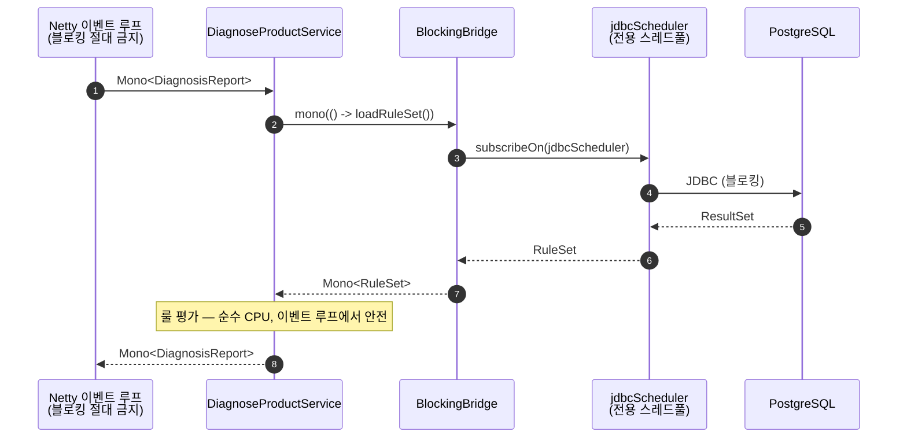

# 02. 헥사고날 아키텍처

## 2.1 의존 방향

헥사고날의 규칙은 하나뿐입니다. **모든 의존성 화살표는 안쪽을 향한다.** 도메인은 바깥을 모릅니다.

```mermaid
flowchart LR
    subgraph in["Inbound Adapter"]
        WEB["Web Adapter<br/>@RestController"]
        SCHED["Scheduler Adapter<br/>문서 갱신 배치"]
    end

    subgraph app["Application"]
        direction TB
        UC["UseCase 구현<br/>@UseCase"]
        PIN["Inbound Port<br/>(interface)"]
        POUT["Outbound Port<br/>(interface)"]
        PIN -.-> UC
        UC -.-> POUT
    end

    subgraph dom["Domain — 의존성 0"]
        AGG["Aggregate<br/>Diagnosis"]
        VO["Value Object<br/>ProductProfile · ReadinessScore"]
        SVC["Domain Service<br/>RuleEvaluator · ScoreCalculator"]
    end

    subgraph out["Outbound Adapter"]
        JPA["Persistence Adapter<br/>JPA + PostgreSQL"]
        RAGA["RAG Adapter<br/>WebClient → AI 워커"]
        LLMA["Narration Adapter<br/>WebClient → AI 워커"]
    end

    WEB --> PIN
    SCHED --> PIN
    UC --> AGG
    UC --> SVC
    POUT <|.. JPA
    POUT <|.. RAGA
    POUT <|.. LLMA

    style dom fill:#e8f5e9,stroke:#2e7d32
    style app fill:#e3f2fd,stroke:#1565c0
```

`POUT <|.. JPA`는 **구현(implements)** 관계입니다. 애플리케이션은 `SaveDiagnosisPort` 인터페이스만 알고, JPA 어댑터가 그것을 구현합니다. 화살표가 어댑터에서 애플리케이션으로 향한다는 점 — 이것이 의존성 역전이고, 헥사고날의 전부입니다.

## 2.2 포트 목록

포트는 "애플리케이션이 바깥 세계와 대화하기 위해 필요한 것"의 목록입니다. 구현체가 아니라 **필요**로부터 이름을 짓습니다. (`QdrantRepository`가 아니라 `SearchEvidencePort`)

### Inbound Port — 시스템이 제공하는 것

| 포트 | 역할 |
| --- | --- |
| `DiagnoseProductUseCase` | 제품 정보를 받아 진단 실행, 리포트 생성 |
| `GetDiagnosisReportQuery` | 진단 ID로 리포트 조회 |
| `RequestConsultingUseCase` | 진단 결과 기반 컨설팅 리드 접수 |
| `ReloadRuleSetUseCase` | 룰셋 버전 갱신 (운영/배치) |

### Outbound Port — 시스템이 필요로 하는 것

| 포트 | 구현 어댑터 | 실패 시 |
| --- | --- | --- |
| `LoadRuleSetPort` | JPA (`rule`, `rule_set` 테이블) | **진단 실패** — 룰 없이는 판정 불가 |
| `SaveDiagnosisPort` | JPA (`diagnosis` 애그리거트) | **진단 실패** |
| `LoadDiagnosisPort` | JPA | 조회 실패 |
| `SearchEvidencePort` | WebClient → AI 워커 `/search` | **폴백** — 근거 없는 리포트 + 경고 |
| `NarrateReportPort` | WebClient → AI 워커 `/narrate` | **폴백** — 템플릿 문장 |
| `SubmitConsultingLeadPort` | JPA | 접수 실패 |
| `TimeProvider` | `SystemTimeProvider` | — |
| `IdGenerator` | `UuidV7IdGenerator` | — |

`TimeProvider`와 `IdGenerator`도 포트입니다. 도메인이 `Instant.now()`나 `UUID.randomUUID()`를 직접 부르면 그 순간 테스트에서 시간을 고정할 수 없고, 룰 평가가 순수 함수라는 [핵심 원칙 3](README.md#핵심-원칙-세-가지)이 깨집니다.

## 2.3 패키지 구조

```
backend/src/main/java/com/certimakers/
├── CertiMakersApplication.java
│
├── common/                        ← 이번 단계에서 구현
│   ├── domain/
│   │   ├── error/                 ErrorType · ErrorCode · BusinessException
│   │   ├── model/                 AggregateRoot · DomainEvent
│   │   └── port/                  TimeProvider · IdGenerator
│   ├── application/annotation/    @UseCase
│   ├── adapter/
│   │   ├── in/web/                ApiResponse · GlobalExceptionHandler · TraceIdFilter · @WebAdapter
│   │   └── out/
│   │       ├── persistence/       BaseTimeEntity · @PersistenceAdapter
│   │       └── system/            SystemTimeProvider · UuidV7IdGenerator
│   └── config/                    BlockingBridge · JpaAuditingConfig · WebClientConfig
│
├── diagnosis/                     ← 진단 바운디드 컨텍스트
│   ├── domain/                    Diagnosis · ProductProfile · ReadinessScore · RuleEvaluator
│   ├── application/
│   │   ├── port/in/               DiagnoseProductUseCase
│   │   ├── port/out/              LoadRuleSetPort · SearchEvidencePort · ...
│   │   └── service/               DiagnoseProductService
│   └── adapter/
│       ├── in/web/                DiagnosisController · 요청/응답 DTO
│       └── out/
│           ├── persistence/       DiagnosisJpaEntity · DiagnosisPersistenceAdapter
│           └── ai/                RagSearchAdapter · LlmNarrationAdapter
│
└── consulting/                    ← 컨설팅 연계 바운디드 컨텍스트
    └── (동일 구조)
```

컨텍스트를 먼저 나누고 그 안에서 계층을 나눕니다(`diagnosis/domain`), 반대가 아닙니다(`domain/diagnosis`). 기능 단위로 코드가 모여 있어야 6명이 서로 다른 파일을 만집니다.

## 2.4 ArchUnit이 강제하는 규칙

단일 모듈에서 계층을 지키려면 컴파일러가 아니라 테스트가 파수꾼 역할을 해야 합니다. `ArchitectureTest`가 CI에서 다음을 검증합니다.



| # | 규칙 | 이유 |
| --- | --- | --- |
| 1 | `domain`은 `application` · `adapter`를 참조하지 않는다 | 의존성 역전의 정의 |
| 2 | `domain`은 Spring · JPA · Jakarta를 참조하지 않는다 | 도메인은 순수 자바여야 프레임워크 없이 테스트된다 |
| 3 | `application`은 `adapter`를 참조하지 않는다 | 어댑터 교체 가능성 |
| 4 | `adapter.in`은 `adapter.out`을 참조하지 않는다 | 어댑터끼리는 서로 모른다 |
| 5 | UseCase 구현체는 `@UseCase`를 붙인다 | 스테레오타입 일관성 |
| 6 | 필드 주입(`@Autowired` on field) 금지 | 생성자 주입으로 불변 보장 |
| 7 | 순환 의존 금지 (슬라이스 단위) | — |

규칙 2가 가장 자주 깨집니다. 도메인 클래스에 무심코 `@Entity`를 붙이는 순간입니다. JPA 엔티티는 `adapter.out.persistence`에 별도로 두고, 어댑터가 도메인 ↔ 엔티티를 매핑합니다. 매핑 코드가 늘어나는 비용을 감수하는 대신 도메인 테스트가 밀리초 단위로 끝납니다.

## 2.5 블로킹 경계

WebFlux 위에서 JPA를 쓰기로 했으므로([ADR-0002](adr/0002-webflux-with-jpa.md)), **블로킹 호출이 일어나는 지점이 정확히 어디인지**가 아키텍처 관심사가 됩니다.



`jdbcScheduler`의 스레드 수는 **HikariCP 커넥션 풀 크기와 같아야** 합니다. 더 크면 스레드가 커넥션을 기다리며 쌓이고, 더 작으면 커넥션이 논다. 이 값은 `application.yml`에서 한 곳으로 묶어 관리합니다.

모든 JPA 호출은 `BlockingBridge`를 통과합니다. ArchUnit으로 강제하기는 어려우니, 코드 리뷰 체크포인트로 둡니다. 테스트 프로파일에서는 BlockHound를 붙여 이벤트 루프 블로킹을 런타임에 잡습니다.
