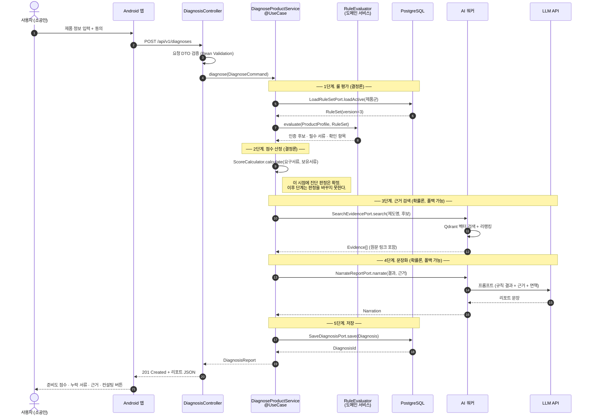
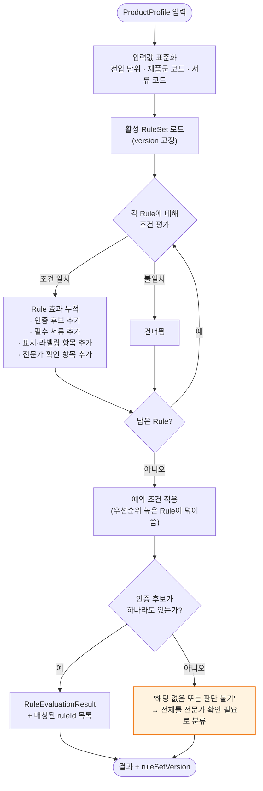
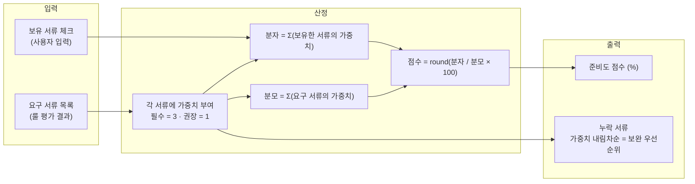
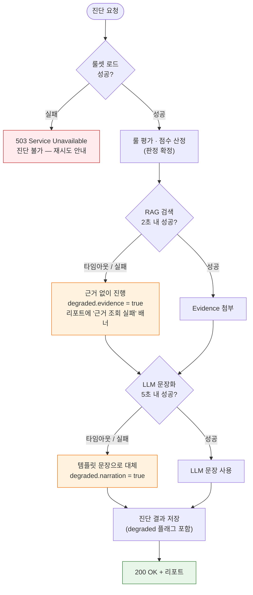
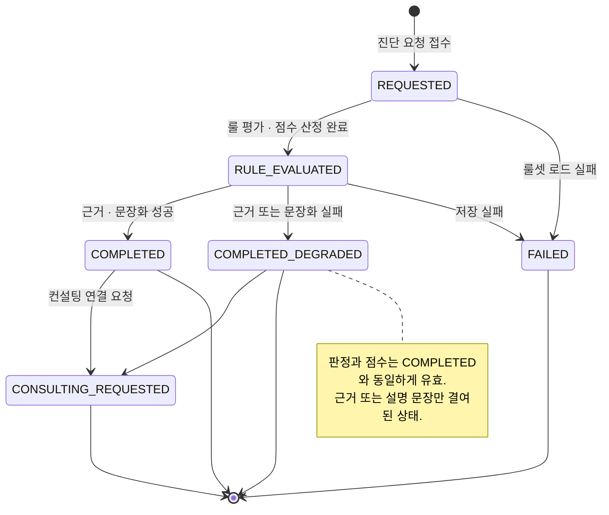

# 03. 진단 흐름

## 3.1 전체 시퀀스

1~2단계와 3~4단계 사이의 주석이 이 시스템의 핵심입니다. **2단계가 끝나면 진단 결과는 이미 확정**되어 있고, 3~4단계는 그 결과에 근거와 설명을 덧붙일 뿐입니다.

## 3.2 룰 평가

`UNKNOWN` 경로가 중요합니다. 룰이 아무것도 못 잡았을 때 LLM에게 "그럼 네가 판단해봐"라고 넘기는 순간 서비스의 신뢰성 전제가 무너집니다. 판단하지 못했다는 사실을 그대로 사용자에게 전달하고 전문가 상담으로 연결하는 것이 정답입니다.

**매칭된 `ruleId` 목록을 결과에 함께 저장**합니다. "왜 이 인증이 후보로 나왔는가"를 사후에 추적할 수 있어야 하고, 이것이 검증 단계의 "규칙 일치 여부 확인" 방법이 됩니다.

## 3.3 준비도 점수 산정

점수는 합격 가능성이 아니라 **공식 요구자료 대비 현재 준비 수준**입니다. 계산식은 단순해야 하고, 사용자에게 그대로 보여줄 수 있어야 합니다.

가중치를 코드에 하드코딩하지 않고 `document_weight` 테이블에 두는 이유는, 점수 기준표가 산출물 목록에 포함되어 있고 심사에서 근거를 요구받기 때문입니다. 가중치를 바꿔도 코드 배포가 필요 없어야 합니다.

**보완 우선순위 = 누락 서류를 가중치 내림차순으로 정렬한 것**입니다. 별도 알고리즘이 아닙니다. 점수를 가장 많이 올리는 순서가 곧 우선순위입니다.

## 3.4 장애 폴백 정책

| 실패 지점 | 결과 | 사용자에게 보이는 것 |
| --- | --- | --- |
| 룰셋 로드 | **진단 실패 (503)** | "일시적으로 진단할 수 없습니다" |
| RAG 검색 | 진단 성공, 근거 없음 | 점수·서류는 정상, "공식 근거를 불러오지 못했습니다" 배너 |
| LLM 문장화 | 진단 성공, 템플릿 문장 | 점수·서류·근거는 정상, 설명 문장만 정형화됨 |
| 진단 저장 | **진단 실패 (500)** | "저장에 실패했습니다" |

`degraded` 플래그를 응답과 DB에 모두 남깁니다. 시연 중 네트워크가 흔들려도 데모는 계속 돌아가야 하고, 사후에 "그때 왜 근거가 비어 있었는가"를 답할 수 있어야 합니다.

## 3.5 상태 전이

## 3.6 API 개요

| 메서드 | 경로 | 설명 |
| --- | --- | --- |
| `POST` | `/api/v1/diagnoses` | 진단 실행 — 제품 정보 + 동의 |
| `GET` | `/api/v1/diagnoses/{id}` | 진단 리포트 조회 |
| `GET` | `/api/v1/diagnoses/{id}/evidences` | 근거 문단 목록 (원문 링크) |
| `POST` | `/api/v1/consulting-leads` | 컨설팅 연결 요청 |
| `GET` | `/api/v1/product-groups` | 제품군 · 입력 스키마 메타데이터 |
| `GET` | `/actuator/health` | 헬스체크 |

모든 응답은 `ApiResponse<T>` 봉투로 감쌉니다. Android 팀이 성공/실패 분기를 한 곳에서 처리할 수 있도록 하기 위함이고, `traceId`를 항상 실어 보내 장애 시 로그 추적이 가능하게 합니다.
