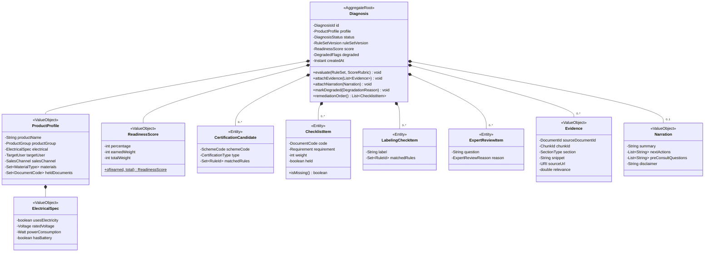
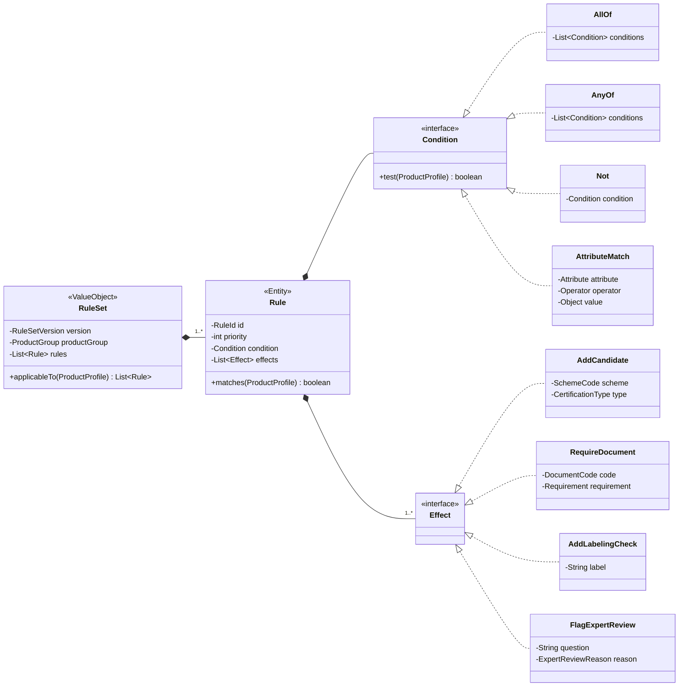
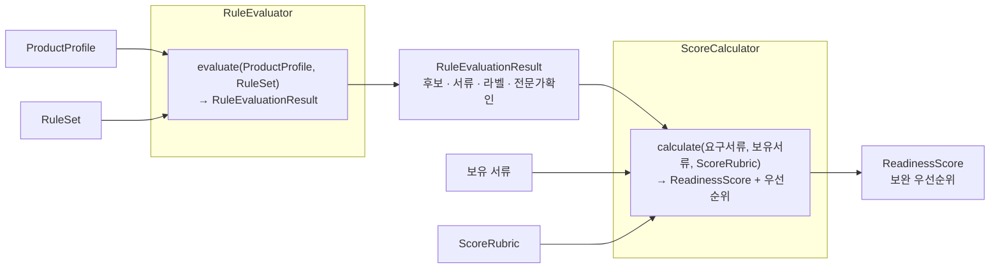

# 04. 도메인 모델

## 4.1 유비쿼터스 언어

코드·DB·문서·앱 화면에서 같은 개념은 같은 이름을 씁니다.

| 한국어 | 코드 | 정의 |
| --- | --- | --- |
| 진단 | `Diagnosis` | 한 번의 자가진단 실행 결과 전체. 애그리거트 루트 |
| 제품 프로파일 | `ProductProfile` | 사용자가 입력한 제품 속성의 표준화된 형태 |
| 제품군 | `ProductGroup` | 소형가전 하위 분류 (드라이기류 등) |
| 인증 후보 | `CertificationCandidate` | 룰이 식별한 검토 대상 인증. 확정 판정이 아님 |
| 인증 유형 | `CertificationType` | 안전인증 · 안전확인 · 공급자적합성확인 |
| 준비도 점수 | `ReadinessScore` | 요구자료 대비 준비 수준(%). 합격 예측이 아님 |
| 체크리스트 항목 | `ChecklistItem` | 요구 서류 하나와 그 보유 여부 |
| 표시·라벨링 항목 | `LabelingCheckItem` | 제품 표시사항 확인 항목 |
| 전문가 확인 필요 항목 | `ExpertReviewItem` | 룰·근거로 단정할 수 없어 격리한 항목 |
| 근거 | `Evidence` | 공식 문서에서 검색된 문단과 원문 링크 |
| 룰셋 | `RuleSet` | 특정 시점에 활성화된 룰의 버전된 집합 |
| 컨설팅 리드 | `ConsultingLead` | 진단 결과에 연결된 상담 요청 |

"인증 후보"에서 *후보*를, "준비도 점수"에서 *준비도*를 지우면 안 됩니다. 서비스가 법적으로 인증 여부를 판정하지 않는다는 사실이 이름에 박혀 있어야 합니다.

## 4.2 애그리거트

`Diagnosis`는 한 트랜잭션에서 통째로 저장·조회되는 하나의 애그리거트입니다. 리포트를 보여주려면 어차피 전부 필요하고, 부분 수정이 일어나지 않습니다. 쪼갤 이유가 없습니다.

`ConsultingLead`는 **별도 애그리거트**입니다. `DiagnosisId`만 참조로 들고, 다른 바운디드 컨텍스트(`consulting`)에 속합니다. 컨설팅 상태 변경이 진단 애그리거트를 잠그면 안 됩니다.

## 4.3 룰 모델

조건은 `AllOf`/`AnyOf`/`Not`/`AttributeMatch`로 구성된 트리입니다. 이 네 가지면 "전기를 사용하고, 정격전압이 50V를 초과하며, 어린이용이 아닌 경우" 같은 실제 KC 조건을 표현하기에 충분합니다. 규칙 20~30개 규모에서 범용 룰 엔진 라이브러리(Drools 등)를 끌어오는 것은 과합니다 — 직접 만든 인터프리터가 더 작고, 디버깅하기 쉽고, JSON으로 직렬화해 DB에 넣기 좋습니다.

`Effect`를 sealed interface로 두면 새 효과 타입을 추가할 때 컴파일러가 누락된 처리 지점을 잡아 줍니다.

## 4.4 도메인 서비스

두 개면 됩니다. 둘 다 **순수 함수**이고, 스프링 빈이 아니며, 밀리초 안에 테스트됩니다.

`RuleEvaluator`가 스프링 빈이 아니라는 점이 핵심입니다. `new RuleEvaluator().evaluate(profile, ruleSet)`로 테스트할 수 있어야 합니다. 룰 20~30개 × 예외 입력 조합을 검증하는 것이 이 프로젝트에서 가장 중요한 테스트이고, 그 테스트가 스프링 컨텍스트 로딩을 기다린다면 아무도 자주 돌리지 않습니다.

## 4.5 불변식

애그리거트가 스스로 지켜야 하는 규칙입니다. 생성자와 메서드에서 검증합니다.

| # | 불변식 |
| --- | --- |
| 1 | `ReadinessScore.percentage`는 0 이상 100 이하 |
| 2 | `totalWeight`가 0이면 점수는 0이 아니라 **산정 불가** — 요구 서류가 없다는 것은 룰이 아무것도 못 잡았다는 뜻 |
| 3 | `status = COMPLETED`이면 `score`와 `ruleSetVersion`이 반드시 존재 |
| 4 | `attachEvidence`/`attachNarration`은 `status = RULE_EVALUATED` 이후에만 호출 가능 |
| 5 | 인증 후보가 비어 있으면 `ExpertReviewItem`이 최소 1개 존재 |
| 6 | `Evidence`는 `sourceUrl` 없이 존재할 수 없음 — 출처 없는 근거는 근거가 아님 |
| 7 | `ChecklistItem.weight > 0` |

불변식 2와 6은 코드로 강제해야 하는 **신뢰성 요구사항**입니다. 리뷰에서 놓치기 쉬우므로 도메인 단위 테스트에 이름을 그대로 붙여 둡니다.
