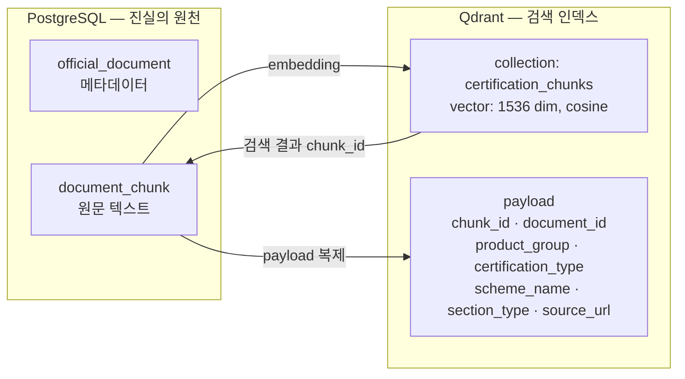

# 05. 데이터 모델

## 5.1 PostgreSQL ERD

```mermaid
erDiagram
    RULE_SET ||--o{ RULE : contains
    RULE_SET {
        uuid id PK
        int version UK "제품군별 버전"
        varchar product_group "SMALL_APPLIANCE"
        boolean active
        timestamptz activated_at
        timestamptz created_at
    }
    RULE {
        uuid id PK
        uuid rule_set_id FK
        varchar rule_code UK "R-SA-001"
        int priority "높을수록 우선, 예외 조건에 사용"
        jsonb condition "조건 트리"
        jsonb effects "효과 배열"
        text description
        uuid source_document_id FK "근거 문서"
    }

    OFFICIAL_DOCUMENT ||--o{ DOCUMENT_CHUNK : "chunked into"
    OFFICIAL_DOCUMENT ||--o{ RULE : "grounds"
    OFFICIAL_DOCUMENT {
        uuid id PK
        varchar title
        varchar issuer "국가기술표준원 · KTC · KTR"
        date published_at
        date verified_at "우리가 최종 확인한 날"
        varchar product_group
        varchar certification_type
        varchar scheme_name "제도명"
        text source_url
        timestamptz created_at
    }
    DOCUMENT_CHUNK {
        uuid id PK
        uuid document_id FK
        varchar section_type "SCHEME · SCOPE · DOCUMENTS · LABELING · EXCEPTION"
        text content
        int seq
        uuid qdrant_point_id "Qdrant 포인트 ID"
        timestamptz created_at
    }

    DOCUMENT_WEIGHT {
        varchar document_code PK "BIZ_LICENSE · CIRCUIT_DIAGRAM ..."
        varchar display_name
        varchar requirement "REQUIRED · RECOMMENDED"
        int weight "필수 3 · 권장 1"
        text note
    }

    DIAGNOSIS ||--|| PRODUCT_PROFILE : snapshots
    DIAGNOSIS ||--o{ CERTIFICATION_CANDIDATE : identifies
    DIAGNOSIS ||--o{ CHECKLIST_ITEM : requires
    DIAGNOSIS ||--o{ LABELING_CHECK_ITEM : requires
    DIAGNOSIS ||--o{ EXPERT_REVIEW_ITEM : flags
    DIAGNOSIS ||--o{ DIAGNOSIS_EVIDENCE : grounds
    DIAGNOSIS ||--o| NARRATION : explains
    DIAGNOSIS ||--o{ CONSULTING_LEAD : "converts to"
    DIAGNOSIS ||--|| CONSENT_LOG : "recorded with"

    DIAGNOSIS {
        uuid id PK "UUIDv7 — 시간 정렬"
        varchar status "REQUESTED · RULE_EVALUATED · COMPLETED · COMPLETED_DEGRADED · FAILED"
        uuid rule_set_id FK "평가에 사용한 룰셋"
        int rule_set_version "재현용 스냅샷"
        int readiness_score "0~100, nullable"
        int earned_weight
        int total_weight
        boolean degraded_evidence
        boolean degraded_narration
        timestamptz created_at
        timestamptz updated_at
    }
    PRODUCT_PROFILE {
        uuid diagnosis_id PK_FK
        varchar product_name
        varchar product_group
        boolean uses_electricity
        int rated_voltage "V, nullable"
        int power_consumption "W, nullable"
        boolean has_battery
        varchar target_user "GENERAL · CHILD · INDUSTRIAL"
        varchar sales_channel "ONLINE · OFFLINE · BOTH"
        jsonb materials
        jsonb held_documents "DocumentCode 배열"
    }
    CERTIFICATION_CANDIDATE {
        uuid id PK
        uuid diagnosis_id FK
        varchar scheme_code
        varchar certification_type "SAFETY_CERT · SAFETY_CONFIRM · SUPPLIER_DOC"
        jsonb matched_rule_codes "왜 이 후보가 나왔는가"
    }
    CHECKLIST_ITEM {
        uuid id PK
        uuid diagnosis_id FK
        varchar document_code FK
        varchar requirement "REQUIRED · RECOMMENDED"
        int weight "평가 시점의 가중치 스냅샷"
        boolean held
    }
    LABELING_CHECK_ITEM {
        uuid id PK
        uuid diagnosis_id FK
        text label
        jsonb matched_rule_codes
    }
    EXPERT_REVIEW_ITEM {
        uuid id PK
        uuid diagnosis_id FK
        text question
        varchar reason "NO_MATCHING_RULE · NO_EVIDENCE · AMBIGUOUS_CONDITION"
    }
    DIAGNOSIS_EVIDENCE {
        uuid id PK
        uuid diagnosis_id FK
        uuid document_chunk_id FK
        varchar section_type
        text snippet
        text source_url
        double_precision relevance
    }
    NARRATION {
        uuid diagnosis_id PK_FK
        text summary
        jsonb next_actions
        jsonb pre_consult_questions
        text disclaimer
        varchar model_id "생성에 쓴 LLM"
        boolean is_template_fallback
    }

    CONSULTING_LEAD {
        uuid id PK
        uuid diagnosis_id FK
        varchar contact_name
        varchar contact_phone "암호화 저장"
        varchar contact_email "암호화 저장"
        text message
        varchar status "SUBMITTED · CONTACTED · CLOSED"
        timestamptz created_at
    }
    CONSENT_LOG {
        uuid id PK
        uuid diagnosis_id FK
        boolean privacy_consent
        boolean sensitive_info_consent
        boolean service_limit_acknowledged
        varchar consent_version "약관 버전"
        timestamptz consented_at
    }

    DOCUMENT_WEIGHT ||--o{ CHECKLIST_ITEM : "weights"
    DOCUMENT_CHUNK ||--o{ DIAGNOSIS_EVIDENCE : cited
```

### 설계 의도

**`diagnosis.rule_set_version`을 별도 컬럼으로 중복 저장합니다.** `rule_set_id`가 있는데도 그렇게 하는 이유는, 룰셋이 나중에 삭제되거나 변경되어도 "이 진단은 v3 룰로 평가되었다"는 사실이 남아야 하기 때문입니다. 감사 추적을 외래키에 의존하면 안 됩니다.

**`checklist_item.weight`도 스냅샷입니다.** 가중치 기준표(`document_weight`)를 나중에 조정해도 과거 진단의 점수는 재계산되지 않아야 합니다. 참조 무결성보다 재현성이 우선입니다.

**`certification_candidate.matched_rule_codes`** — 후보가 나온 근거 룰을 배열로 들고 있습니다. "왜 이 인증이 뜨나요"라는 심사위원 질문에 즉시 답할 수 있습니다.

**개인정보는 `consulting_lead`에만 존재합니다.** 진단 자체는 익명이며 연락처를 모릅니다. 기획서의 "개인정보 최소수집"을 스키마 수준에서 보장하는 방법입니다. 연락처 컬럼은 애플리케이션 레벨 암호화(AES-GCM) 후 저장합니다.

**파일 업로드 테이블이 없습니다.** 의도된 것입니다. 해커톤 범위에서 서류는 `held_documents` jsonb 배열의 코드 목록일 뿐입니다.

## 5.2 Qdrant 컬렉션



Qdrant는 **인덱스이지 저장소가 아닙니다.** 원문은 PostgreSQL에 있고, Qdrant가 유실되어도 재색인으로 복구됩니다.

payload에 `product_group`, `certification_type`, `section_type`을 복제해 두는 이유는 **필터링된 벡터 검색** 때문입니다. "드라이기류 + 안전확인 + 제출서류 섹션" 안에서만 유사도 검색을 하면, top-k의 정확도가 눈에 띄게 올라갑니다. 전체 코퍼스에서 검색한 뒤 후처리로 거르면 관련 문단이 top-k 밖으로 밀려납니다.

### 검색 쿼리 형태

```
filter:
  must:
    - product_group == "SMALL_APPLIANCE"
    - certification_type in ["SAFETY_CONFIRM"]     # 룰이 식별한 후보만
    - section_type in ["DOCUMENTS", "LABELING"]    # 리포트 항목에 맞춰
query_vector: embed("안전확인 대상 전기용품 제출 서류")
limit: 5
score_threshold: 0.65                              # 미달 시 Evidence 없음 → 전문가 확인 필요
```

`score_threshold`가 [불변식 6](04-domain-model.md#45-불변식)("출처 없는 근거는 근거가 아님")의 실행 지점입니다. 임계값을 못 넘으면 억지로 근거를 붙이는 대신 `ExpertReviewItem(reason = NO_EVIDENCE)`을 만듭니다.

## 5.3 마이그레이션 전략

Flyway로 버전 관리합니다. `backend/src/main/resources/db/migration/`.

| 파일 | 내용 |
| --- | --- |
| `V1__baseline.sql` | 확장(`pgcrypto`), 공통 함수 |
| `V2__rule_and_document.sql` | `rule_set`, `rule`, `official_document`, `document_chunk`, `document_weight` |
| `V3__diagnosis.sql` | `diagnosis` 애그리거트 테이블 |
| `V4__consulting.sql` | `consulting_lead`, `consent_log` |
| `R__seed_document_weight.sql` | 반복 실행 — 가중치 기준표 시드 |
| `R__seed_rules.sql` | 반복 실행 — 샘플 룰 20~30개 |

룰과 가중치는 **반복 가능 마이그레이션(`R__`)** 으로 관리합니다. 해커톤 기간 내내 계속 손볼 데이터이고, 매번 새 버전 파일을 만드는 것은 낭비입니다. 체크섬이 바뀌면 Flyway가 자동으로 재적용합니다.

## 5.4 인덱스

| 테이블 | 인덱스 | 이유 |
| --- | --- | --- |
| `rule` | `(rule_set_id, priority DESC)` | 룰셋 로드 시 우선순위 정렬 |
| `rule_set` | `(product_group, active)` partial `WHERE active` | 활성 룰셋 조회 |
| `diagnosis` | PK가 UUIDv7 | 시간 정렬 → B-tree 지역성 확보, 랜덤 UUID의 인덱스 단편화 회피 |
| `checklist_item` | `(diagnosis_id)` | 애그리거트 로드 |
| `document_chunk` | `(document_id, seq)` | 청크 순서 복원 |
| `consulting_lead` | `(status, created_at DESC)` | 컨설턴트 대시보드 |

`diagnosis.id`에 UUIDv7을 쓰는 이유가 인덱스 항목에 들어 있습니다. `UUID.randomUUID()`(v4)를 PK로 쓰면 삽입이 B-tree 전체에 흩어져 페이지 분할이 잦아집니다. 시간 정렬 UUID는 항상 오른쪽 끝에 삽입됩니다. 이래서 `IdGenerator`가 포트입니다.
